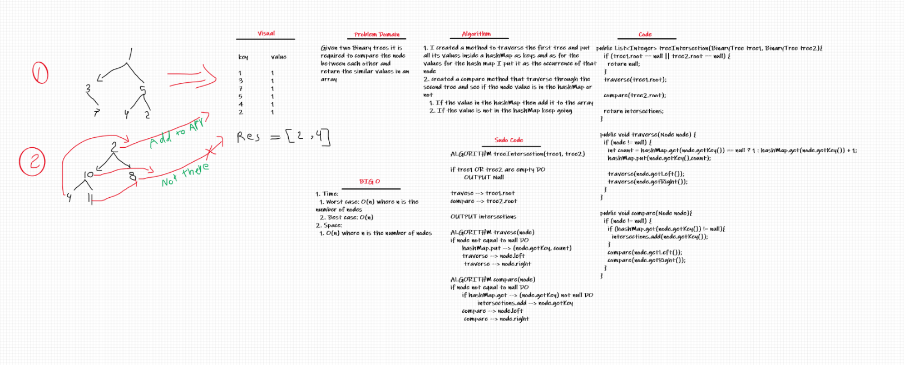

# Challenge Summary
Given two Binary trees it is required to compare the node between each other and return the similar values in an array

## Whiteboard Process

## Approach & Efficiency
1. Time:
  1. Worst case: O(n) where n is the number of nodes
  2. Best case: O(n)
2. Space:
  1. O(n) where n is the number of nodes

## Solution
1. I created a method to traverse the first tree and put all its values inside a hashMap as keys and as for the values for the hash map I put it as the occurrence of that node
2. created a compare method that traverse through the second tree and see if the node value is in the hashMap or not
   1. If the value in the hashMap then add it to the array
   2. If the value is not in the hashMap keep going
