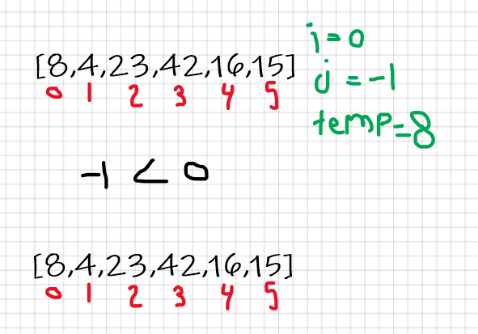
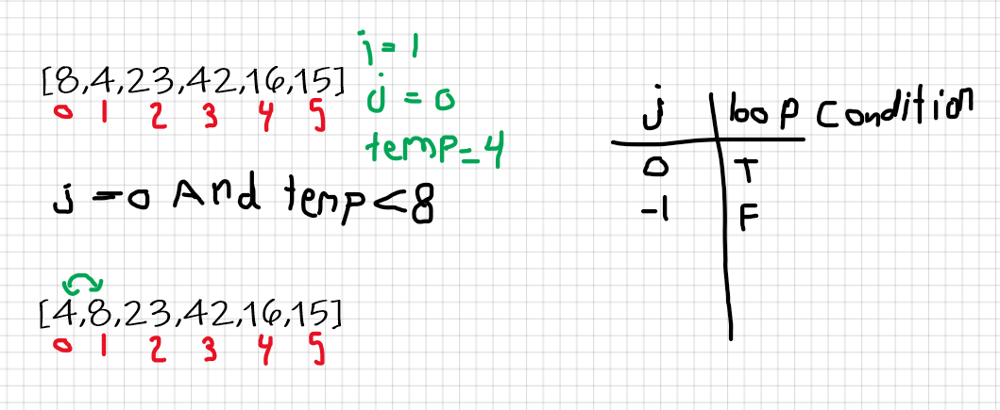
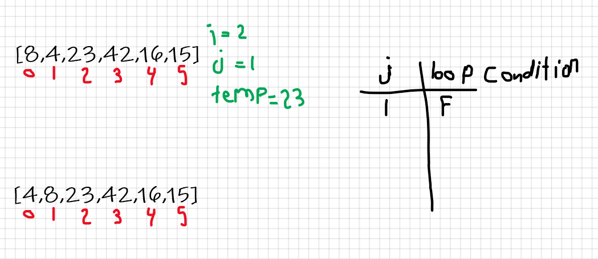
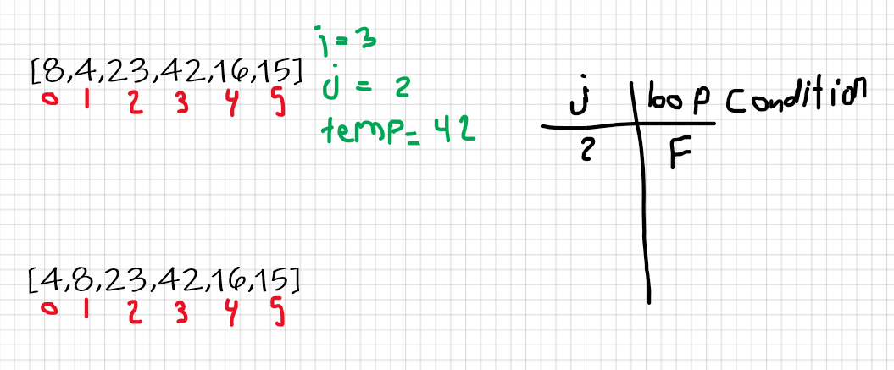
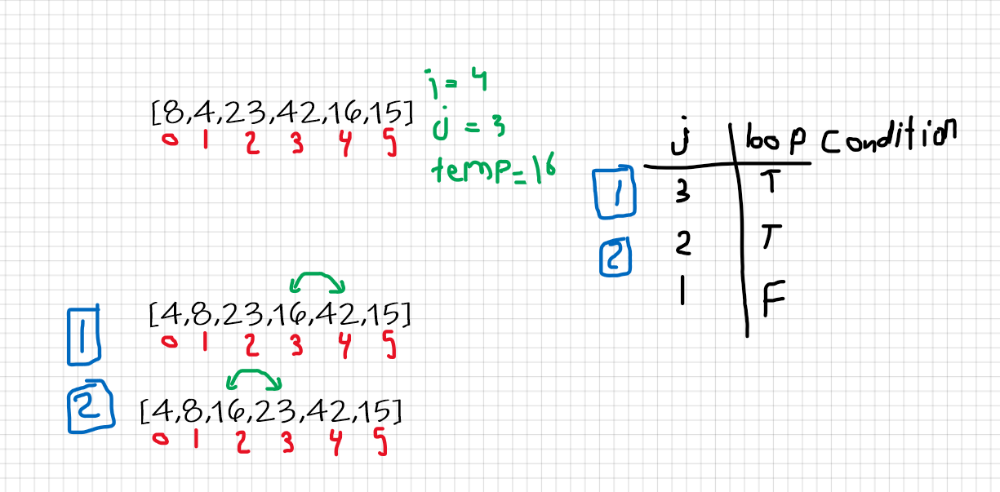
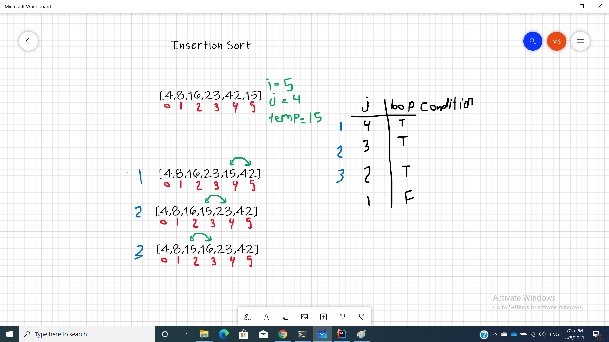

# Insertion Sort
the idea behind Insertion Sort is that it loops through the array and compare each value with all the predecessors' values and if the value directly before is less than the current value nothing will happen, but if the value was larger than the current value replace them and compare the same value with the second predecessor and so on.

## Pseudocode
```
  InsertionSort(int[] arr)

    FOR i = 1 to arr.length

      int j <-- i - 1
      int temp <-- arr[i]

      WHILE j >= 0 AND temp < arr[j]
        arr[j + 1] <-- arr[j]
        j <-- j - 1

      arr[j + 1] <-- temp
```
## Working Code
[InsertionSort](InsertionSort.java)
```java
class InsertionSort {
  public static void main(String[] args) {
    int arr[] = { 8,4,23,42,16,15 };

    InsertionSort insertionSort = new InsertionSort();
    insertionSort.sort(arr);

    for (int num: arr) {
      System.out.println(num);
    }
  }

  void sort(int arr[]) {
    int length = arr.length;
    for (int i = 1; i < length; ++i) {
      int key = arr[i];
      int j = i - 1;

      while (j >= 0 && arr[j] > key) {
        arr[j + 1] = arr[j];
        j = j - 1;
      }
      arr[j + 1] = key;
    }
  }
}
```
## Trace
Sample Array: [8,4,23,42,16,15]

### Pass 1:


### Pass 2:


### Pass 3:


### Pass 4:


### Pass 5:


### Pass 6:


## Efficiency
1. Time: O(n^2)
   Insertion sort takes maximum time to sort if elements are sorted in reverse order. And it takes minimum time (Order of n) when elements are already sorted.
2. Space: O(1)
No additional space is being created. This array is being sorted in place…keeping the space at constant O(1).
