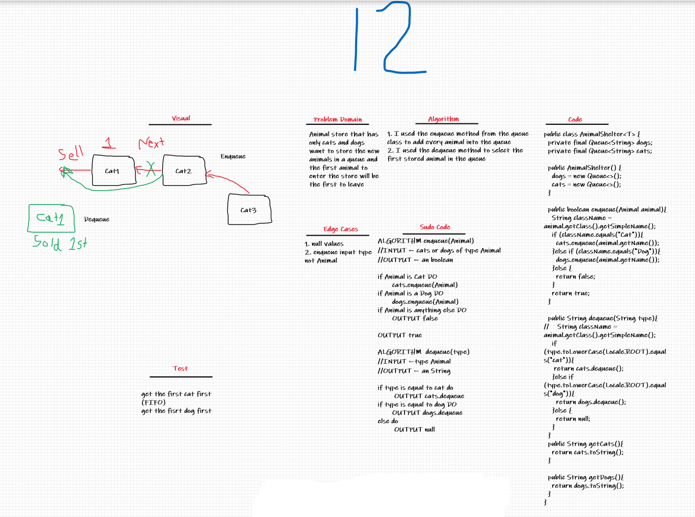

# Challenge Summary
Animal store that has only cats and dogs want to store the new animals in a queue and the first animal to enter the store will be the first to leave

## Whiteboard Process

## Approach & Efficiency
1. you can see the methods in here [AnimalShelter](src/main/java/stackAndQueue/AnimalShelter.java)
- enqueue: O(1)
- dequeue: O(1)

## Solution
- add animal: I used the enqueue method from the [Queue](src/main/java/stackAndQueue/Queue.java) class to add every animal into the queue
- sell animal: I used the dequeue method to get the first animal in the queue and delete it from the queue

