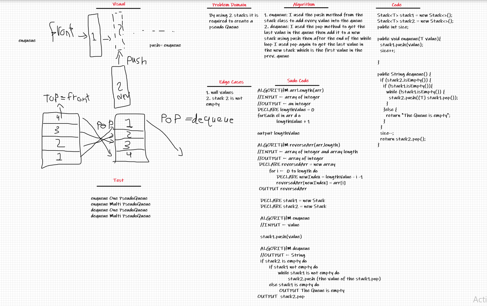

# Challenge Summary (PseudoQueue)
By using 2 stacks I created a pseudo Queue

## Whiteboard Process

## Approach & Efficiency
1. you can see the methods in here [PseudoQueue](src/main/java/stackAndQueue/PseudoQueue.java)
  - enqueue: O(1)
  - dequeue: O(n) used a while loop
## Solution
- enqueue: I used the push method from the [stack](src/main/java/stackAndQueue/Stack.java) class to add every value into the queue
- dequeue: I used the pop method to get the last value in the queue then add it to a new stack using push then after the end of the while loop I used pop again to get the last value in the new stack which is the first value in the prev. queue
