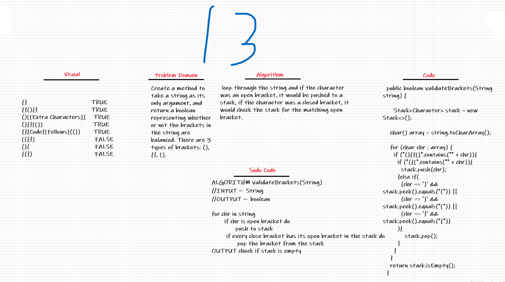

# Multi-bracket Validation

## The Challenge
Create a method to take a string as its only argument, and return a boolean representing whether or not the brackets in the string are balanced. There are 3 types of brackets: `()`, `{}`, `[]`.

## Whiteboard Process

## Approach & Efficiency
My approach was to loop through the string and if the character was an open bracket, it would be pushed to a stack, if the character was a closed bracket, it would check the stack for the matching open bracket.

Time | Memory
---- | ----
O(n) | O(n)
