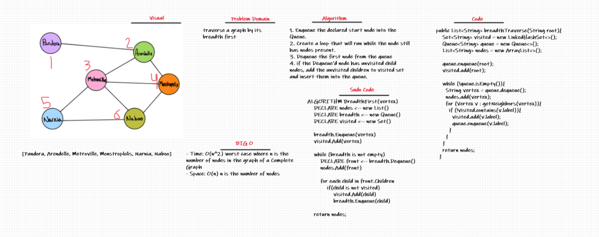

# Graphs
A graph is a non-linear data structure that can be looked at as a collection of vertices (or nodes) potentially connected by line segments named edges.

## Whiteboard Process
1. breadthTraverse
   - 

## Challenge Summary
Implement your own Graph. The graph should be represented as an adjacency list, and should include the following methods:
1. add node
2. add edge
3. get nodes
4. get neighbors
5. size
6. breadthTraverse

## Approach & Efficiency
1. add node
   - Time: O(1)
   - Space: O(1)
2. add edge
  - Time: O(1)
  - Space: O(1)
3. get nodes
  - Time: O(1)
  - Space: O(n): n is the number of nodes
4. get neighbors
  - Time: O(1)
  - Space: O(m) m is the number of the neighbor nodes
5. size
  - Time: O(n): n is the number of nodes
  - Space: O(1)
6. breadthTraverse
   - Time: O(n^2) worst case where n is the number of nodes in the graph of a Complete Graphs
   - Space: O(n) n is the number of nodes

## API
1. add node: only to add a new node into the graph without any connection to other nodes
2. add edge: to add a connection between two nodes with the required weight (the weight is optional)
3. get nodes: to get all the nodes in the graph as a list
4. get neighbors: to get all the connections of the required node as a list
5. size: to get the size (number) of all the nodes in the graph

## Solution
1. breadthTraverse
    - you can just call the method and pass the first node you want the traverse to start from
