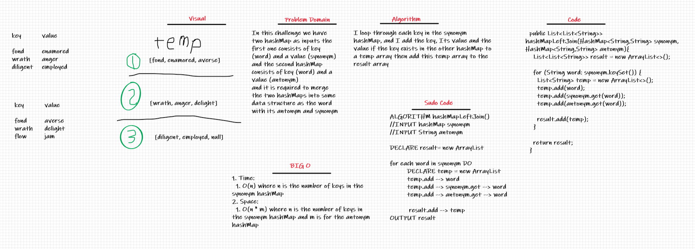

# Hashmap LEFT JOIN
In this challenge we have two hashMap as inputs the first one consists of key (word) and a value (synonym) and the second hashMap consists of key (word) and a value (antonym)
and it is required to merge the two hashMaps into some data structure as the word with its antonym and synonym

## Challenge
1. Combine the key and corresponding values (if they exist) into a new data structure according to LEFT JOIN logic.
2. LEFT JOIN means all the values in the first hashmap are returned, and if values exist in the “right” hashmap, they are appended to the result row.
3. If no values exist in the right hashmap, then some flavor of NULL should be appended to the result row.

## Whiteboard

## Approach & Efficiency
1. Time:
  1. O(n) where n is the number of keys in the synonym hashMap
2. Space:
  1. O(n * m) where n is the number of keys in the synonym hashMap and m is for the antonym hashMap

## Solution
I loop through each key in the synonym hashMap, and I add the key, Its value and the value if the key exists in the other hashMap to a temp array then add this temp array to the result array

