# Challenge 5 Linked List

## Problem Domain
- try to find other ways to store data effectively by using Linked List
---
- [x] Create a Node class
- [x] Create a Linked List class
- [x] include a head property
- [x] insert method Adds a new node with that value to the head of the list
- [x] includes method Indicates whether that value exists as a Node’s value somewhere within the list.
- [x] to string method Returns: a string representing all the values in the Linked List, formatted as:
      "{ a } -> { b } -> { c } -> NULL"
- [x] Can successfully instantiate an empty linked list
- [x] Can properly insert into the linked list
- [x] The head property will properly point to the first node in the linked list
- [x] Can properly insert multiple nodes into the linked list
- [x] Will return true when finding a value within the linked list that exists
- [x] Will return false when searching for a value in the linked list that does not exist
- [x] Can properly return a collection of all the values that exist in the linked list
---
## Code Challenge: Class 06

### Whiteboard table

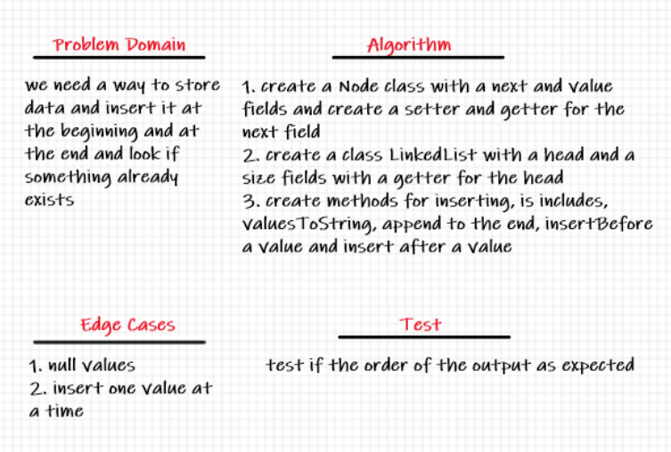

| Code                                   | Sudo Code                                  | Visual                                  |
| -------------------------------------- | ------------------------------------------ | --------------------------------------- |
| 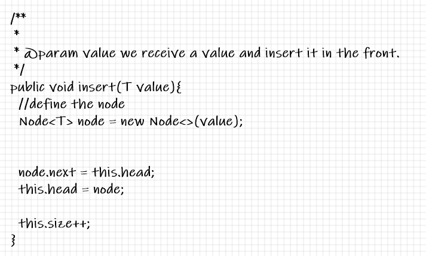         | 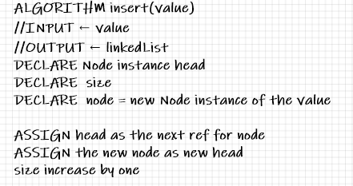         | 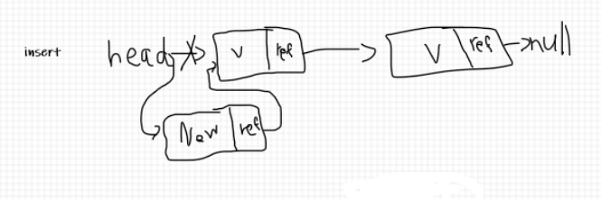         |
| 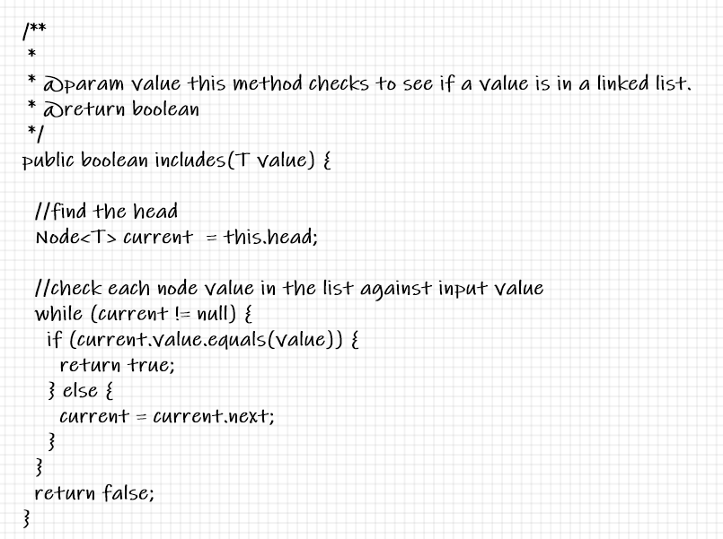       | 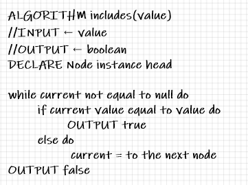       | 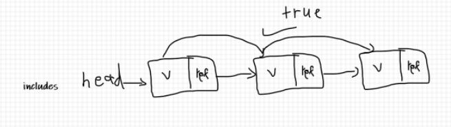       |
| 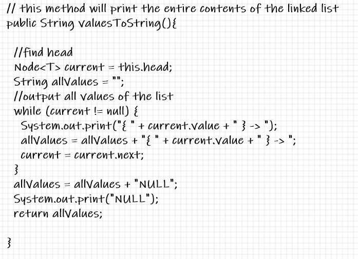 | 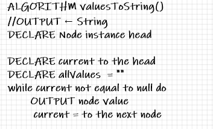 | 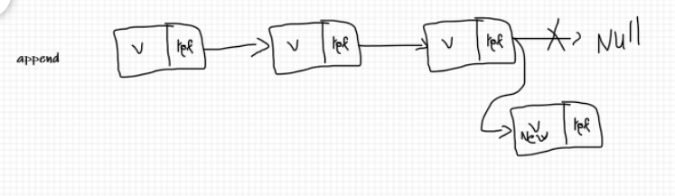 |
| 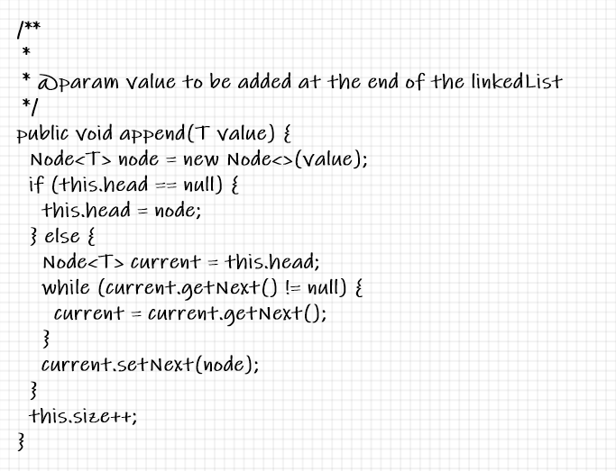         | 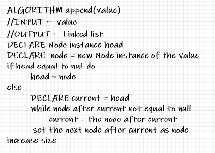         |          |
| 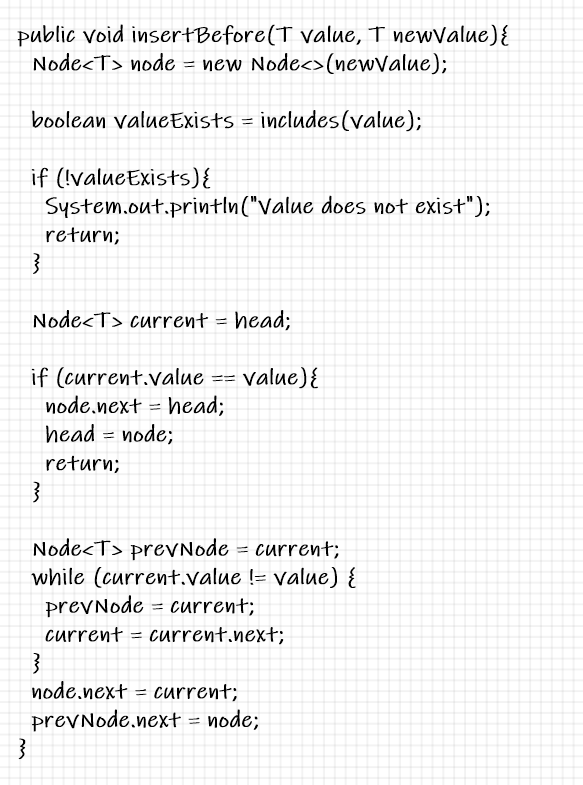   | 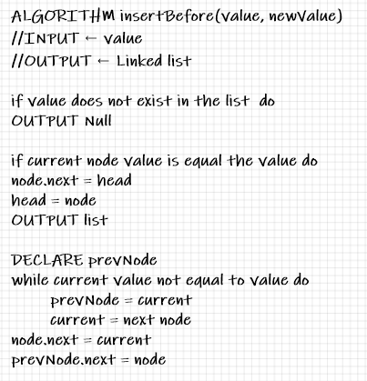   | 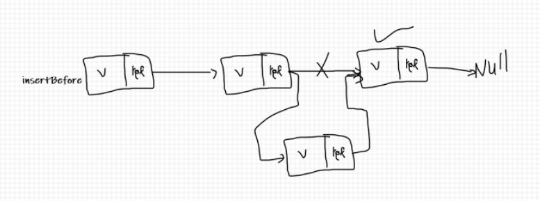   |
| 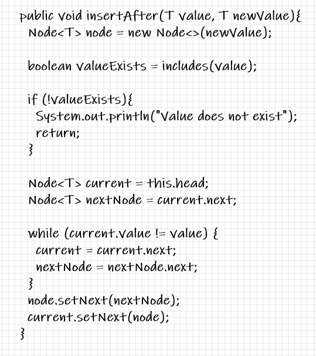    | 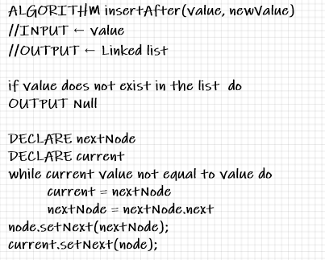    | 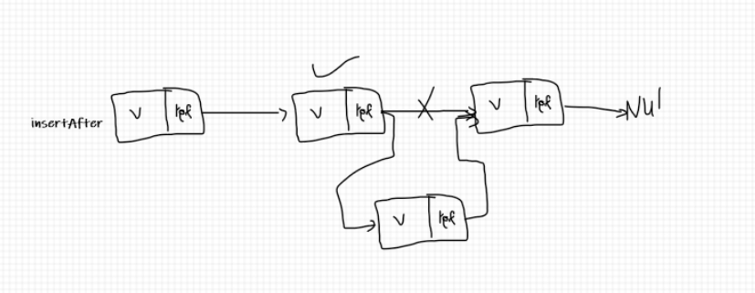    |
| 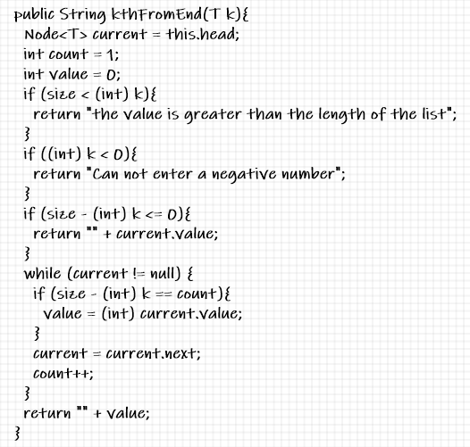    | 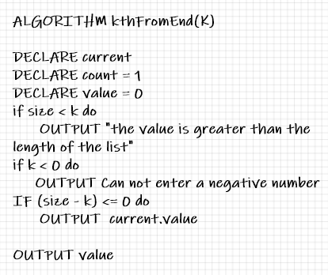    | 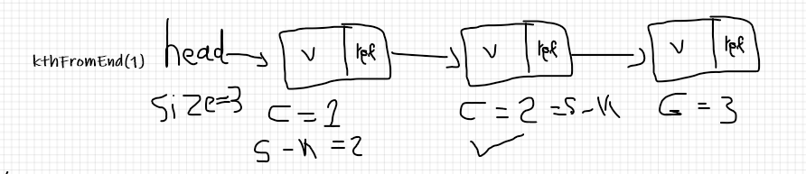    |
| 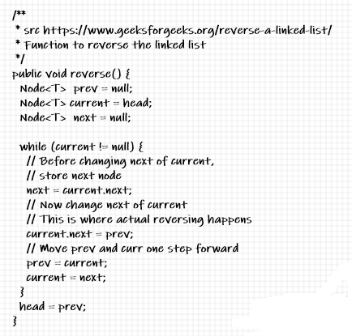    | 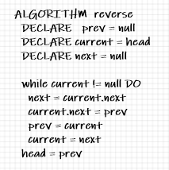    |     |
| 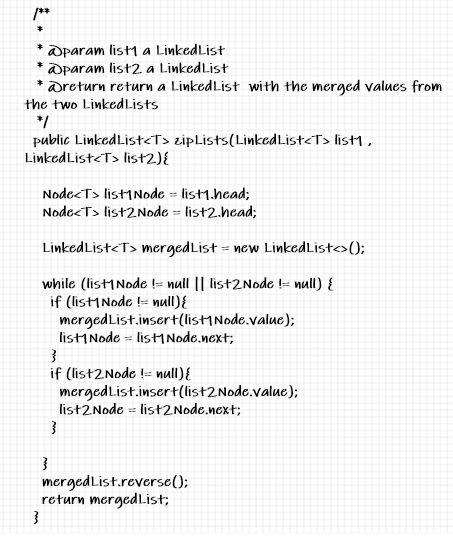    | 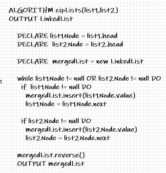    | 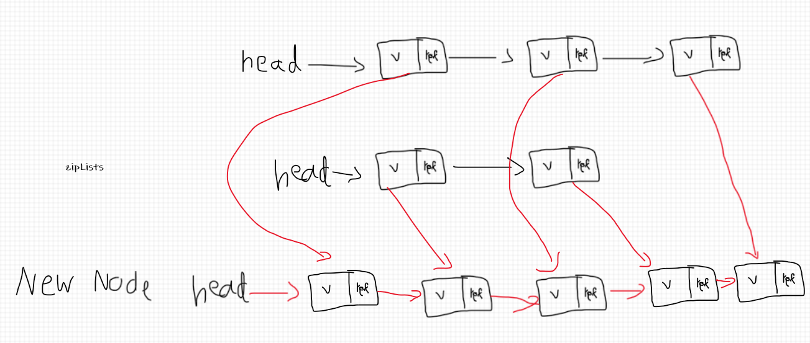    |
---
1. in the [LinkedList](src/main/java/linkedlist/LinkedList.java) file I have 6 methods:
   - insert: to insert new node at the beginning
   - includes: check if the value exist
   - valuesToString: print the values as a string
   - append: append a new node to the end
   - insertBefore: insert a new node before a given value
   - insertAfter: insert a new node after a given value
   - kthFromEnd: return the k th value from the end
   - reverse: reverse the linked list
   - zipLists: Zip the two linked lists together into one so that the nodes alternate between the two lists and return a reference to the head of the zipped list.
---

1. Methods Approach & Efficiency:
  - insert: O(1) all cases
  - includes: O(n)
  - valuesToString: O(n)
  - append: O(n) worst case, O(1) best case
  - insertBefore: O(n) worst case, O(1) best case
  - insertAfter: O(n) worst case, O(1) best case
  - kthFromEnd: O(n) worst case, O(1) best case
  - reverse: O(n)
  - zipLists: O(n): I used a while loop O(n) and inside it, I used the insert method O(1) and outside the loop I used the reverse method
---
1. in the [test](src/test/java/linkedlist/LinkedListTest.java) file I have tests for:

- [x] add a node to the end of the linked list
- [x] add multiple nodes to the end of a linked list
- [x] insert a node before a node located i the middle of a linked list
- [x] insert a node before the first node of a linked list
- [x] insert after a node in the middle of the linked list
- [x] insert a node after the last node of the linked list
- [x] test different cases for kthFromEnd method
- [x] test reverseTest method
- [x] test zipLists method
