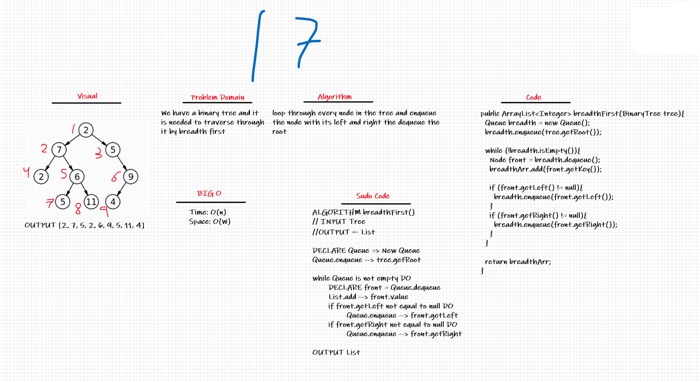
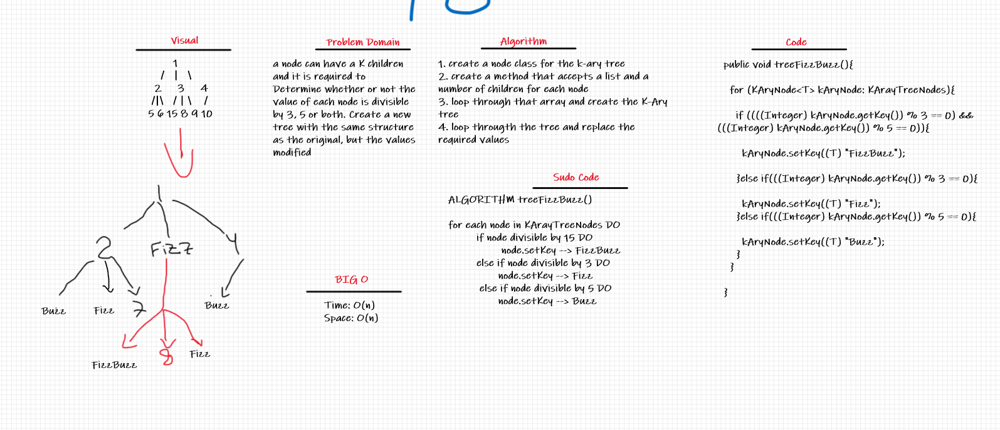

# Trees
Data structures are used to store and organize data. We can use algorithms to manipulate and use our data structures. Different types of data are organized more efficiently by using different data structures.

Trees are non-linear data structures. They are often used to represent hierarchical data. For a real-world example, a hierarchical company structure uses a tree to organize.

## Challenge
1. Create a Node class that has properties for the value stored in the node, the left child node, and the right child node.
2. Implement a binary tree
3. Implement a binary search tree
4. Implement find maximum value
5. Implement breadth first traverse
6. Implement a kAryTree
7. Implement a treeFizzBuzz method

## Whiteboard Process
### Binary Tree

### K-Ary Tree

## Approach & Efficiency
1. [Binary Tree](src/main/java/BinaryTree.java)
  - Time
    - inserting a new node is O(n)
    - Searching for a specific node is O(n)
  - Space
    - O(w), where w is the largest width of the tree
  - Find Maximum method
    - Time O(n)
    - Space O(1)
  - Breadth First
    - Time O(n)
    - space O(w), where w is the largest width of the tree

1. [Binary Search Tree](src/main/java/BinarySearchTree.java)
  - Time
    - insertion and search operations is O(h), or O(height), In a balanced (or “perfect”) tree, the height of the tree is log(n)
  - Space
    - O(1)
1. [K-Ary Tree](src/main/java/kAryTree/KAryTree.java)
   - treeFizzBuzz
     - Time O(n)
     - Space O(n)

## API
1. in [Binary Tree](src/main/java/BinaryTree.java) there are 3 main methods excluding setters and getters
  - preOrderTraverse: to print the data as root >> left >> right
  - inOrderTraverse: to print the data as left >> root >> right
  - postOrderTraverse: to print the data as left >> right >> root
  - maximum: to search through the tree and return the max. value
  - breadthFirst: Breadth first traversal iterates through the tree by going through each level of the tree node-by-node.

1. in [Binary Search Tree](src/main/java/BinarySearchTree.java) I extended the Binary Tree class and added 2 methods:
  - add => input integer: to add a new node to the tree and if the number was larger than the root go to the right and if smaller go to the left
  - contain => input integer: search the tree if the value exists and return true if it does or false if it doesn't
1. [K-Ary Tree](src/main/java/kAryTree/KAryTree.java) I have one method
  - treeFizzBuzz:
    - replace If the value is divisible by 3, replace the value with “Fizz”
    - replace If the value is divisible by 5, replace the value with “Buzz”
    - replace If the value is divisible by 3 and 5, replace the value with “FizzBuzz”

## Solution

1. maximum
  - populate the binary tree with some value (only integers)
  - run the maximum method in the [Binary Tree](src/main/java/BinaryTree.java) class
1. breadthFirst
  - loop through every node in the tree and enqueue the node with its left and right the dequeue the root
1. treeFizzBuzz:
  - loop through every node in the tree and replace every number with the required value
